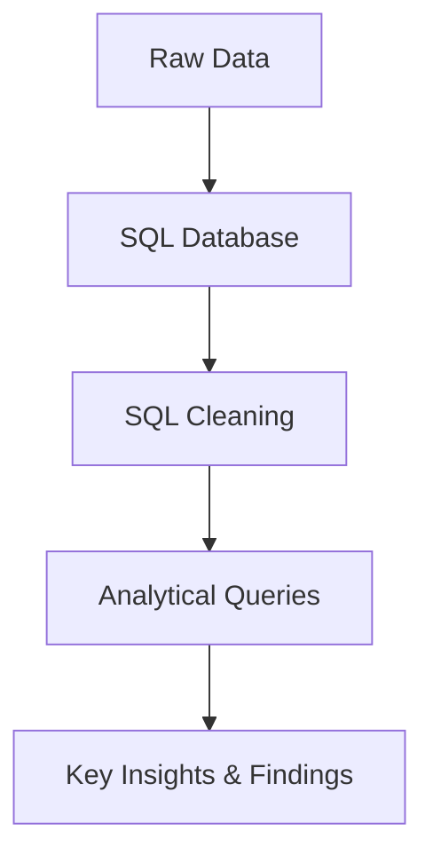

# Apple-Dataset-Query


# Project Overview  

## **Apple Retail Sales Analysis 📊**  

### **Objective**  
This project aims to analyze Apple's retail sales data to uncover key insights into product performance, store revenue distribution, and overall sales trends. The dataset consists of **over 1 million rows** and spans multiple tables, including **products, sales, categories, warranties, and stores.**  

The primary goal is to identify **the top country where each product generates the highest revenue** while also exploring key performance indicators (KPIs) for sales and customer behavior.

### **Key Goals**  
- **Data Cleaning & Preparation:** Process large-scale retail data for accurate analysis.  
- **Sales Performance Analysis:** Identify top-performing products and revenue trends.  
- **Geographical Insights:** Determine which country contributes the most revenue for each product.  
- **Business Intelligence Reporting:** Build **Power BI dashboards** for visual representation and actionable insights.

### **Expected Outcomes**  
By leveraging SQL and Power BI, this project will deliver **data-driven insights** to enhance Apple's retail strategy, optimize store performance, and identify revenue opportunities across different markets.  

### Technology Stack
- **Data Preparation & Loading** - Microsoft Excel
- **DBMS:** PostgreSQL 
- **Query Language:** SQL
- **SQL Queries**: DDL, DML, Aggregations, Joins, Subqueries, Window Functions
- **Data Visualization**: Powerbi (Future Work)
-  
---
## Project Showcase
This project is designed to showcase advanced SQL querying techniques through the analysis of over 1 million rows of Apple retail sales data. The dataset includes information about `products`, `stores`, `sales transactions`, and `warranty claims` across various Apple retail locations globally. Tackling a variety of real-world business questions, and write sophisticated SQL queries that extract valuable insights from this large dataset.

### This project primarily focuses on showcasing the following SQL skills:
- **Complex Joins and Aggregations**: Demonstrating the ability to perform complex SQL joins and aggregate data meaningfully.
- **Window Functions**: Using advanced window functions for running totals, growth analysis, and time-based queries.
- **Data Segmentation**: Analyzing data across different time frames to gain insights into product performance.
- **Correlation Analysis**: Applying SQL functions to determine relationships between variables, such as product price and warranty claims.
- **Real-World Problem Solving**: Answering business-related questions that reflect real-world scenarios faced by data analysts.

---

## Data Processing Pipeline



---

### **Dataset Overview**  
- Dataset was downloaded from [Get the Project Datasets](https://topmate.io/zero_analyst/1237072)
  
### Entity Relationship Diagram (ERD)


## Dataset Description
- **Size**: 1 million+ rows of sales data.
- **Period Covered**: The data spans multiple years, allowing for long-term trend analysis.
- **Geographical Coverage**: Sales data from Apple stores across various countries.

The dataset consists of five interconnected tables:  
- **Sales** – Transaction-level sales data.  
- **Products** – Information on product categories and pricing.  
- **Stores** – Details of retail store locations and countries.  
- **Categories** – Classification of Apple products.  
- **Warranty** – Information on product warranties and coverage.  

The project uses five main tables:

1. **stores**: Contains information about Apple retail stores.
   - `store_id`: Unique identifier for each store.
   - `store_name`: Name of the store.
   - `city`: City where the store is located.
   - `country`: Country of the store.

2. **category**: Holds product category information.
   - `category_id`: Unique identifier for each product category.
   - `category_name`: Name of the category.

3. **products**: Details about Apple products.
   - `product_id`: Unique identifier for each product.
   - `product_name`: Name of the product.
   - `category_id`: References the category table.
   - `launch_date`: Date when the product was launched.
   - `price`: Price of the product.

4. **sales**: Stores sales transactions.
   - `sale_id`: Unique identifier for each sale.
   - `sale_date`: Date of the sale.
   - `store_id`: References the store table.
   - `product_id`: References the product table.
   - `quantity`: Number of units sold.

5. **warranty**: Contains information about warranty claims.
   - `claim_id`: Unique identifier for each warranty claim.
   - `claim_date`: Date the claim was made.
   - `sale_id`: References the sales table.
   - `repair_status`: Status of the warranty claim (e.g., Paid Repaired, Warranty Void).

## Project Structure

### 1. Data Preparation & Data Cleaning: 
- Data understanding, exploration, data loading.
- Check dataset structure using Column Headers & Data Types
- Standardizing Data Formats

### 2. Schemas Setup
- **Database Creation:** The project begins with setting up a database named `Apple_db`.  
- **Table Creation:** Create all neccesary table to store required data.
```sql
-- Schema Creation

--STORES TABLE

create table stores(
store_id varchar(10) Primary key,
store_name varchar(30),
city varchar(30),
country varchar(30)
);

select * from stores;

--CAREGORIES TABLE

create table category(
category_id varchar(10) primary key,
category_name varchar(30)
);

select * from category;

--PRODUCTS TABLE

create table products(
product_id varchar(10) primary key,
product_name varchar(35),
category_id varchar(10),
launch_date date,
price float,
constraint fk_category foreign key (category_id) references category(category_id)
);

select * from products;

--SALES TABLE

create table sales(
sale_id varchar(15) primary key,
sale_date date,
store_id varchar(10),
product_id varchar(10),
quantity int,
constraint fk_store foreign key (store_id) references stores(store_id),
constraint fk_product foreign key (product_id) references products(product_id)
);

select * from sales;

--WARRANTY TABLE

create table warranty(
claim_id varchar(15) primary key,
claim_date date,
sale_id varchar(15),
repair_status varchar(20),
constraint fk_sale foreign key (sale_id) references sales(sale_id)
);

select * from warranty;
```
### 4. Key Business Insights
- 1. Find the number of stores in each country.
```sql
SELECT country,
	COUNT (store_id) count_of_country
FROM stores
GROUP BY country
ORDER BY count_of_country DESC;
```
- 2. Calculate the total number of units sold by each store.
```sql
  SELECT st.store_id,
	st.store_name,
	SUM (sl.quantity) sum_quantity
FROM sales sl
JOIN stores st
ON sl.store_id = st.store_id
GROUP BY 1,2
ORDER BY sum_quantity DESC;
```
- 3. Identify how many sales occurred in December 2023.
```sql
SELECT sum_of_sale
FROM(
	SELECT EXTRACT (MONTH FROM sale_date)AS month,
		EXTRACT (YEAR FROM sale_date) AS year,
		COUNT (sale_id) sum_of_sale
	FROM sales
	WHERE EXTRACT (MONTH FROM sale_date) = 12 
		AND EXTRACT (YEAR FROM sale_date) = 2023
	GROUP BY 1,2
	)
```
- 4. Determine how many stores have never had a warranty claim filed.
```sql
SELECT COUNT (*)
FROM stores 
WHERE store_id NOT IN (
						SELECT DISTINCT store_id
							FROM sales sl
							RIGHT JOIN warranty wa
							ON sl.sale_id = wa.sale_id
						)
```
- 5. Calculate the percentage of warranty claims marked as "Completed".
```sql
SELECT DISTINCT repair_status,
		ROUND((count_status::numeric/count_total::numeric) * 100, 2) AS completed_percentage
FROM ( 
		SELECT repair_status,
			COUNT (*) OVER () AS count_total,
			COUNT (*) OVER (PARTITION BY repair_status) count_status
		FROM warranty
	)
WHERE repair_status = 'Completed'
```
- 6. Identify which store had the highest total units sold in the last year.
```sql
SELECT st.store_id,
	st.store_name,
	SUM (sl.quantity) sum_quantity
FROM sales sl
JOIN stores st
ON sl.store_id = st.store_id
WHERE EXTRACT (YEAR FROM sale_date) = 2023
GROUP BY 1,2
ORDER BY sum_quantity DESC
LIMIT 1;
```
- 7. Count the number of unique products sold in the last year.
```sql
SELECT DISTINCT pr.product_id,
	pr.product_name,
	COUNT (sl.product_id) sum_quantity
FROM sales sl
JOIN products pr
ON sl.product_id = pr.product_id
WHERE EXTRACT (YEAR FROM sale_date) = 2023
GROUP BY 1,2
ORDER BY sum_quantity DESC;
```
- 8. Find the average price of products in each category.
```sql
SELECT ca.category_name,
	AVG(pr.price)
FROM category ca
JOIN products pr
ON ca.category_id = pr.category_id
GROUP BY 1
```
- 9. How many warranty claims were filed in 2024?
```sql
SELECT COUNT (*)
FROM warranty
WHERE EXTRACT(YEAR FROM claim_date) = 2024
```
- 10. For each store, identify the best-selling day based on highest quantity sold.
```sql
SELECT 
    store_id,
	store_name,
	sale_date,
	quantity_sold
FROM (
    SELECT 
        st.store_id,
        st.store_name,
		To_char(sale_date, 'day') as day_name,
		SUM (sl.quantity) quantity_sold,
		RANK () OVER (PARTITION BY st.store_id ORDER BY SUM (sl.quantity) DESC) quantity_sold_rank
    FROM sales sl
    JOIN stores st
    ON sl.store_id = st.store_id
	GROUP BY 1,2,3
) sub
WHERE quantity_sold_rank = 1
ORDER BY quantity_sold DESC;
```
### Complex Business Questions

- 11. Identify the least selling product in each country for each year based on total units sold.
```sql
WITH ranked_products AS (
    SELECT 
        st.country,
        pr.product_id,
		pr.product_name,
        EXTRACT(YEAR FROM sl.sale_date) AS sale_year,
        SUM(sl.quantity) AS total_units_sold,
        RANK() OVER (
            PARTITION BY st.country, EXTRACT(YEAR FROM sl.sale_date) 
            ORDER BY SUM(sl.quantity) ASC
        ) AS rank
    FROM 
        sales sl
    JOIN 
        stores st ON sl.store_id = st.store_id
    JOIN 
        products pr ON sl.product_id = pr.product_id
    GROUP BY 
        st.country, pr.product_id, EXTRACT(YEAR FROM sl.sale_date)
)
SELECT 
    country,
    product_id,
	product_name,
    sale_year,
    total_units_sold
FROM 
    ranked_products
WHERE 
    rank = 1
ORDER BY 
    sale_year, country;
```
- 12. Calculate how many warranty claims were filed within 180 days of a product sale.
```sql
SELECT COUNT (*)
FROM (
		SELECT 
	    wa.claim_id,
	    sl.sale_date,
	    wa.claim_date,
		wa.claim_date - sl.sale_date 
	FROM warranty wa
	JOIN sales sl
	    ON wa.sale_id = sl.sale_id
	WHERE wa.claim_date - sl.sale_date > 0 AND wa.claim_date - sl.sale_date <= 180
	)
```
- 13. Determine how many warranty claims were filed for products launched in the last two years.
```sql
SELECT pr.product_id,
	pr.product_name,
	COUNT (wa.claim_id)
FROM products pr
JOIN sales sl
	ON pr.product_id = sl.product_id
LEFT JOIN warranty wa
	ON sl.sale_id = wa.sale_id
WHERE launch_date >= CURRENT_DATE - INTERVAL '2 Years'
GROUP BY 1
```
- 14. List the months in the last three years where sales exceeded 5,000 units in the USA.
```sql
SELECT 
	to_char(sl.sale_date, 'MM-YYYY') AS MONTH,
	SUM (sl.quantity) sum_quantity
FROM sales sl
JOIN stores st
ON sl.store_id = st.store_id
WHERE st.country = 'United States' AND sale_date >= CURRENT_DATE - INTERVAL '3 Years'
GROUP BY 1
HAVING SUM (quantity) > 5000 
ORDER BY 1
```
- 15. Identify the product category with the most warranty claims filed in the last two years.
```sql
SELECT
	ca.category_id,
	ca.category_name,
	COUNT (wa.claim_id)
FROM sales sl
LEFT JOIN warranty wa
ON sl.sale_id = wa.sale_id
LEFT JOIN products pr
ON sl.product_id = pr.product_id
JOIN category ca
ON pr.category_id = ca.category_id
WHERE wa.claim_date >= CURRENT_DATE - INTERVAL '2 YEARS'
GROUP BY 1,2
ORDER BY 3 DESC;
```
- 16. Determine the percentage chance of receiving warranty claims after each purchase for each country.
```sql
SELECT 
    country,
    ROUND((total_claims::numeric 
           / quantity_sold::numeric) * 100, 2) AS percentage_of_claims
FROM (
    SELECT 
        st.country,
        SUM(sl.quantity) AS quantity_sold,
		COUNT(wa.claim_id) AS total_claims
    FROM sales sl
    LEFT JOIN warranty wa
        ON sl.sale_id = wa.sale_id
    JOIN stores st 
        ON sl.store_id = st.store_id
    GROUP BY st.country
) sub
ORDER BY 2 DESC;
```
- 17. Analyze the year-by-year growth ratio for each store.
```sql
SELECT *,
	LAG (total_amt_sold, 1) OVER (PARTITION BY store_name) amt_prv_year,
	ROUND((total_amt_sold - LAG (total_amt_sold, 1) OVER (PARTITION BY store_name))::numeric / 
											LAG (total_amt_sold, 1) OVER (PARTITION BY store_name)::numeric * 100,2)
FROM
		( SELECT st.store_name,
		EXTRACT (YEAR FROM sale_date) AS year,
		SUM (quantity * pr.price) total_amt_sold
	FROM sales sl
	JOIN stores st
	ON sl.store_id = st.store_id
	JOIN products pr
	ON sl.product_id = pr.product_id
	GROUP BY 1,2
	)
```
- 18. Calculate the correlation between product price and warranty claims for products sold in the last five years, segmented by price range.
```sql
SELECT
	CASE
		WHEN pr.price <= 500  THEN 'Lower cost'
		WHEN pr.price > 500 AND pr.price <= 1000 THEN 'mModerate cost'
	ELSE 'High cost'
	END AS price_segment,
	COUNT (wa.claim_id) no_of_claims
FROM sales sl
LEFT JOIN warranty wa
ON sl.sale_id = wa.sale_id
LEFT JOIN products pr
ON sl.product_id = pr.product_id
WHERE wa.claim_date >= CURRENT_DATE - INTERVAL '5 Years'
GROUP BY 1
ORDER BY 2 DESC;
```
- 19. Identify the store with the highest percentage of "Rejected" claims relative to total claims filed.
```sql
WITH t1 AS 
	(
	SELECT st.store_id,
	st.store_name,
	COUNT (wa.claim_id) rejected_status
FROM sales sl
LEFT JOIN warranty wa
ON sl.sale_id = wa.sale_id
JOIN stores st 
ON sl.store_id = st.store_id
WHERE repair_status = 'Rejected'
GROUP BY 1
	),

t2 AS 
	( 
		SELECT st.store_id,
		st.store_name,
		COUNT (wa.claim_id) total_status
	FROM sales sl
	LEFT JOIN warranty wa
	ON sl.sale_id = wa.sale_id
	JOIN stores st 
	ON sl.store_id = st.store_id
	GROUP BY 1
	)

SELECT t1.store_id,
	t1.store_name,
	t1.rejected_status,
	t2.total_status,
	ROUND((rejected_status::numeric
						/total_status::numeric)* 100,2) rejected_status_percentage
FROM t1
JOIN t2
ON t1.store_id = t2.store_id
```
- 20. Write a query to calculate the monthly running total of sales for each store over the past four years and compare trends during this period.
```sql
SELECT *,
	SUM (total_amt_sold) OVER (PARTITION BY store_name ORDER BY year,month)
FROM
		( 
	SELECT st.store_name,
		EXTRACT (MONTH FROM sale_date) AS month,
		EXTRACT (YEAR FROM sale_date) AS year,
		SUM (quantity * pr.price) total_amt_sold
	FROM sales sl
	JOIN stores st
	ON sl.store_id = st.store_id
	JOIN products pr
	ON sl.product_id = pr.product_id
	WHERE sale_date >= CURRENT_DATE - INTERVAL '4 Years'
	GROUP BY 1,3,2
	)
```
- 21. Analyze product sales trends over time, segmented into key periods: from launch to 6 months, 6-12 months, 12-18 months, and beyond 18 months.
```sql
SELECT 
	pr.product_id,
	pr.product_name,
	CASE 
		WHEN sl.sale_date BETWEEN pr.launch_date AND pr.launch_date + INTERVAL '6 Months' THEN '6 months'
		WHEN sl.sale_date BETWEEN pr.launch_date + INTERVAL '6 Months' 
										AND pr.launch_date + INTERVAL '12 Months' THEN '6-12 months'
		WHEN sl.sale_date BETWEEN pr.launch_date + INTERVAL '12 Months' 
										AND pr.launch_date + INTERVAL '18 Months' THEN '12-18 months'

		ELSE 'Beyond 18months'
		END AS Key_periods,
	SUM (sl.quantity)
FROM sales sl
JOIN products pr
ON sl.product_id = pr.product_id
GROUP BY 3,2,1 
```

## Business Recommendations & Conclusion

### Business Recommendations

Based on the analysis of Apple's retail sales data, several key recommendations can be made to optimize business performance:

1. **Optimize Store Presence in High-Sales Regions**  
   - Certain countries have a significantly higher number of stores and sales volume. Apple can use this data to strategically open new stores in high-demand regions while optimizing resources in underperforming areas.

2. **Improve Product Launch Strategies**  
   - The sales trend analysis indicates that most product sales peak within the first 6-12 months after launch. Apple should enhance marketing efforts in this window to maximize revenue.
   - Post-launch strategies such as bundling offers or discounts on older models can be leveraged to sustain sales momentum beyond the initial peak period.

3. **Enhance Warranty and Customer Service Strategies**  
   - Countries with a high percentage of warranty claims should be investigated further to identify potential product quality or customer service issues.
   - Stores with a high rejection rate of warranty claims may indicate a need for better communication with customers or process improvements.

4. **Strengthen Inventory and Supply Chain Management**  
   - The least-selling products in each country should be evaluated for potential phase-out or repositioning strategies to optimize inventory costs.
   - Monthly running total analysis shows seasonal sales trends, which can help in better demand forecasting and inventory management.

5. **Targeted Pricing Strategy Based on Customer Segments**  
   - The correlation between price and warranty claims suggests that lower-priced products may have higher claim rates. This insight can be used to adjust pricing strategies or introduce premium service plans.

6. **Leverage Data for Marketing and Promotions**  
   - Best-selling days per store can help in planning special promotions or exclusive sales events on peak days.
   - Warranty claim trends can be used to introduce extended warranty offers where necessary to increase customer confidence.

### Conclusion

This project demonstrates how SQL can be leveraged to extract meaningful insights from vast amounts of retail sales data. By analyzing product sales, warranty claims, store performance, and customer behavior, Apple can make data-driven decisions to improve sales, optimize inventory, enhance customer service, and refine marketing strategies.  

The findings provide actionable recommendations that can drive revenue growth, improve operational efficiency, and strengthen Apple's market position in the retail industry. With continued data analysis and integration with business intelligence tools, Apple can further enhance its decision-making process and remain competitive in the evolving retail landscape. 

---

## 📌 About Me
Hi, I'm Oluwatosin Amosu Bolaji, a Data Analyst with strong skills in Python, SQL, Power BI, and Excel. I turn raw data into actionable insights through automation, data storytelling, and visual analytics.

- **💡 Tools & Tech:** **Python** (Pandas, NumPy, Matplotlib, Seaborn) | **SQL** (MsSQL, Postgree, MySQL) | **Microsoft Power BI** | **Microsoft Excel**
- **🔹 Key Skills:** Data wrangling, dashboarding, reporting, and process optimization.
-       
-    
-   
- 

#### 🚀 **Always learning. Always building. Data-driven to the core.**  

### 📫 **Let’s connect!**  
- 📩 oluwabolaji60@gmail.com
- 🔗 : [LinkedIn](https://www.linkedin.com/in/oluwatosin-amosu-722b88141)
- 🌐 : [My Portfolio](https://www.datascienceportfol.io/oluwabolaji60) 
- 𝕏 : [Twitter/X](https://x.com/thee_oluwatosin?s=21&t=EqoeQVdQd038wlSUzAtQzw)
- 🔗 : [Medium](https://medium.com/@oluwabolaji60)
- 🔗 : [View my Repositories](https://github.com/Tbrown1998?tab=repositories)
